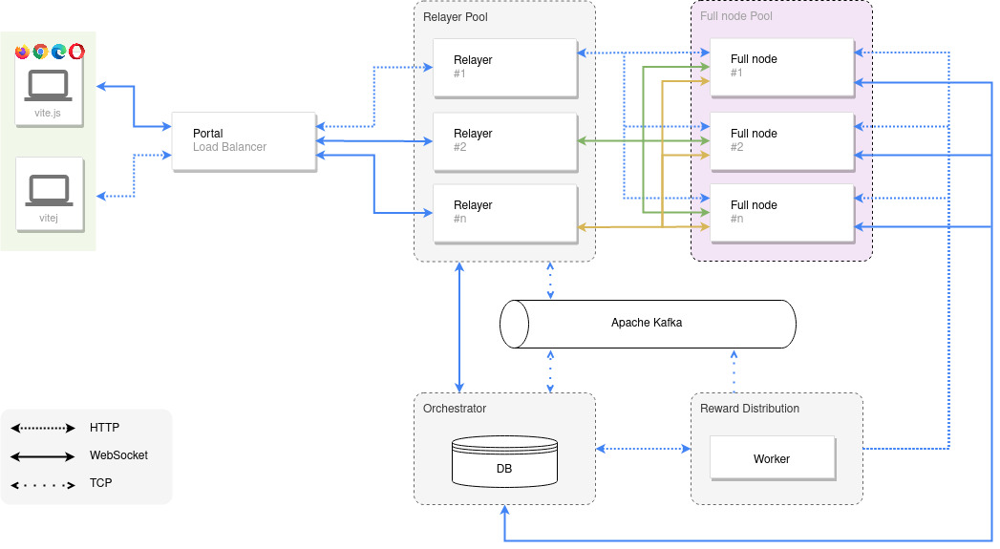

# VitePortal

VitePortal is a scaling solution to help process the increasing amount of Remote Procedure Calls (RPCs). This is achieved by introducing a load balancer responsible for spawning relayers as needed. A relayer is a standalone application which forwards every RPC request to multiple full nodes and handles the responses. By determining the majority result (consensus) it is possible to reward honest or punish malicious full nodes and thus incentivize them to partake in the process.

<h1 align="center">
	
</h1>

This monorepo is organized as follows:

- [lb](./lb) - the load balancer accepts incoming traffic from clients and routes requests to its registered relayers
- [relayer](./relayer) - the relayer forwards every RPC request to multiple full nodes and handles the responses
- [orchestrator](./orchestrator) - the orchestrator keeps track of the global state such as participating full nodes
- [worker](./worker) - the worker is responsible to send out rewards to full nodes on a daily basis

## Session handling

<h1 align="center">
	
</h1>

## Docker

### Build

```
docker build -f relayer.Dockerfile --tag vitelabs/portal-relayer:test .
```

## Docker compose

### Build

```
docker-compose build
```

### Start

```
docker-compose up -d
```

### Stop

```
docker-compose down
```

### Inspect r1

```
docker exec -it vite-portal_r1_1 /bin/bash
```

## Experimental deployment

1. docker-compose build
2. docker-compose up -d
3. [Insert node(s)](./relayer#put_node) with the curl command
4. [Relay request](./relayer#post_relay) with the curl command

The current experimental deployment contains the relayer only. Afer developing [orchestrator](./orchestrator) the third step to insert nodes manually will not be needed anymore. In the planned/final deployment all nodes will automatically connect to the orchestrator if configured correctly and the orchestrator will broadcast newly added or updated nodes to all relayers.